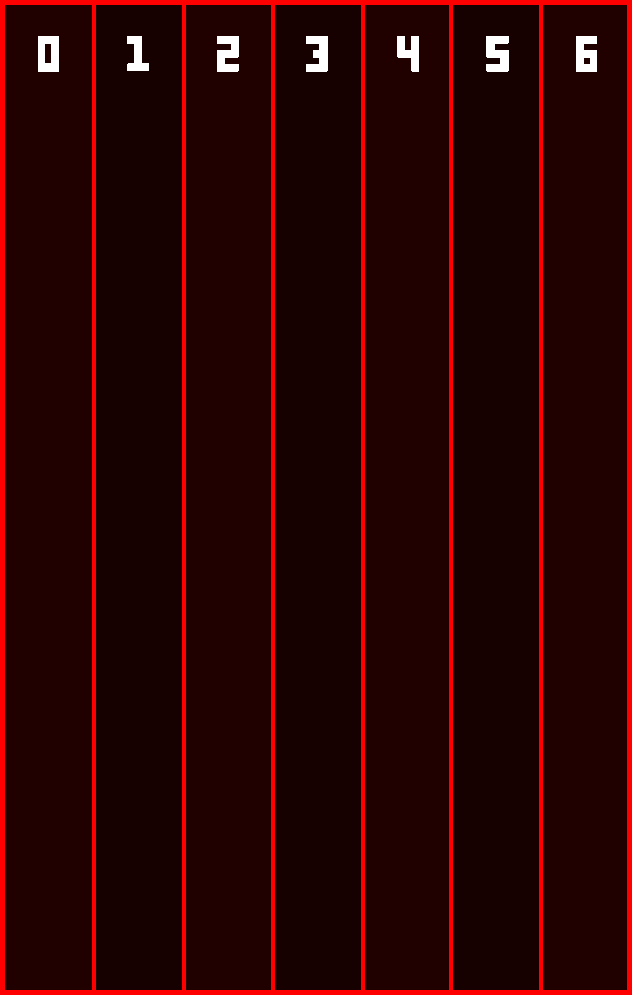

<!DOCTYPE html>
<html lang = "en-US">
    <head>
        <meta charset="utf-8">
        <meta name="author" content="Dan Isamu">
        <meta name="description" content="Lightstreak page">
        <link href="https://fonts.googleapis.com/css2?family=Open+Sans&display=swap" rel="stylesheet">
        <link href="Styles/style.css" rel="stylesheet" type="text/css">
        <link rel="icon" href="Images/Icon.png">
        <title>Lightstreak</title>
    </head>

    <body>
        <h1>Lightstreak</h1>
        <main>
            <section>
                <article>
                    

                        <strong>Lighstreak</strong> é um “defense typing game”. Nele, o jogador luta contra hordas de inimigos usando a digitação para ativar armas como lasers, mísseis e esferas de energia.
                    

                    

                        <strong>OBJETIVO DO PROJETO</strong> 
                        O objetivo principal do projeto é expandir o gênero de jogos de digitação e criar um jogo intrinsecamente divertido.
                        Jogos de digitação costumam se manter em seu próprio nicho, e raramente exploram outros gêneros (exceções: STEREOtype e Epistory).
                        Assim, Lightstreak deve oferecer uma mistura de habilidade técnica (digitação) e combinações emergentes e estratégicas (as mecânicas do jogo).
                    

                    

                        <strong>PLATAFORMAS-ALVO</strong> 
                        -PC (Principal) 
                        -Mobile
                    

                </article>

                <aside>
                    
                </aside>

            </section>
            <section>
                <header>
                    <h2>MECÂNICA</h2>
                </header>

                <aside>
                    
                        
                    
                </aside>

                <article>
                    

                        <strong>RUNDOWN</strong> 
                        Todo o jogo é focado no uso do teclado. Inimigos avançam em diferentes lanes, e o jogador precisa derrotá-los antes que eles alcancem a parte inferior da tela.
                        Para isso, ele tem acesso a canhões que são ativados pela digitação de palavras mostradas na tela. No decorrer do jogo, o jogador recebe múltiplos canhões, que
                        podem ser usados em lanes diferentes para melhor controle de incursões simultâneas.
                    

                    

                        <strong>OBJETIVO</strong> 
                        O jogo consiste de fases numeradas. Para passar de uma fase, o jogador precisa sobreviver toda a incursão inimiga. Por outro lado, o jogador é derrotado caso
                        inimigos demais atravessem o limite inferior da tela.
                    

                    

                        <strong>GAMEPLAY</strong> 
                        Em toda fase, inimigos avançam em 7 diferentes lanes, em direção ao limite da tela. O gameplay gira em torno dos canhões do jogador. Cada canhão é associado a
                        um console diferente, nos quais o jogador pode digitar. Acima dos consoles, há uma lista de palavras, cada uma associada a um tipo de poder. 
                        Ao digitar uma dessas palavras em um dos consoles, o poder associado à palavra será ativado no canhão associado ao console. Dessa forma, o jogador pode atacar
                        os inimigos e derrotá-los antes que cheguem ao seu objetivo.

                    

                    

                        <strong>PODERES & CANHÕES</strong> 
                        Poderes são categorizadas em Fácil, Médio e Difícil, o que denota o tamanho e verbosidade das palavras associadas a eles. Quanto mais difícil de ativar for um
                        poder, mais poderoso ele será.  

                        Os poderes variam de ataques diretos aos inimigos, como lasers e machine guns, a habilidades de suporte, como um choque paralisador ou um poder que ativa todos
                        os canhões. 
                        Os canhões são associados a consoles independentes e também podem ser desativados caso sofram dano de alguma forma. Como podem ser posicionados em lanes diferentes,
                        são muito úteis para se defender de ataques simultâneos em múltiplos frontes.

                    

                    

                        <strong>FASES</strong> 
                        Fases são desbloqueadas à medida que anteriores são terminadas.
                        Cada nova fase introduz um novo inimigo, arma ou arena ao jogador, de forma que a progressão ocorra de forma natural e a descoberta seja constante.
                    

                </article>
            </section>

            <section class="mid">
                <header>
                    <h2>ESTÉTICA & SETTING</h2>
                </header>

                <article>
                    

                        <strong>SIMPLICIDADE VISUAL</strong> 
                        O jogo terá um design minimalista, focado em formas geométricas, sprites pixelados e tons vibrantes destacados contra um fundo escuro. A visibilidade do jogador e facilidade de
                        identificar objetos deve tomar o primeiro plano.
                    

                      
                    

                        <strong>INTERNET E NEON</strong> 
                        A atmosfera do jogo é inspirada no zeitgeist da Internet durante a época 2006-2014. Músicas eletrônicas como DotA (Basshunter), Trance (009 Sound System) e My Skateboard Will Go
                        On (Anamanguchi) são exemplos dessa atmosfera. O estilo visual do jogo é inspirado em jogos online do estilo Stick Fights ou simuladores de sabres de luz.
                    

                </article>

                <aside>
                    <iframe width="560" height="315" src="https://www.youtube.com/embed/Pbch07HiJ54" frameborder="0" allow="accelerometer; autoplay; encrypted-media; gyroscope; picture-in-picture" allowfullscreen></iframe>
                    <!--<video src="Images/Explorando Minecraft - Continue »5.mp4" type="video/mp4" controls>
Error!
</video>-->

                    
                </aside>

            </section>
        </main>

    </body>
</html>
